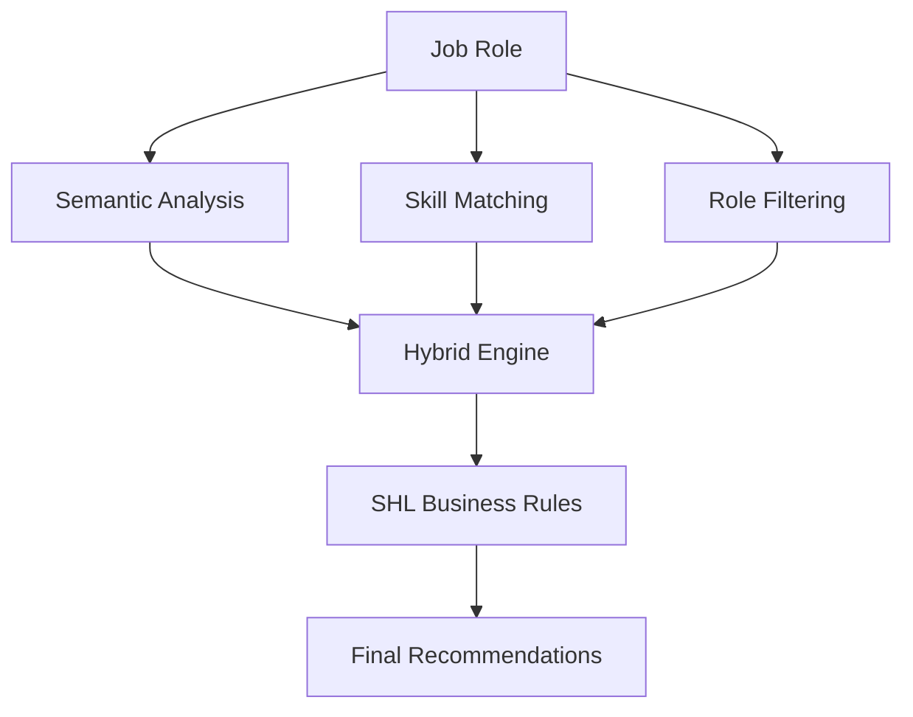
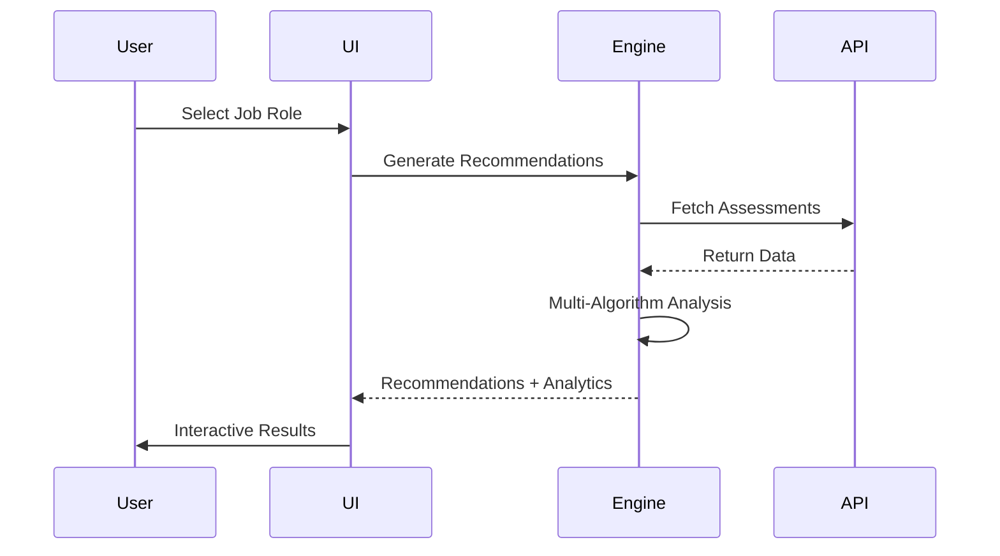

# SHL Assessment Recommendation Engine

<div align="center">

[](https://www.python.org/)
[](https://streamlit.io/)
[](https://www.sbert.net/)
[](https://shl.com/)

An intelligent AI-powered system that matches SHL assessments with job roles using advanced machine learning and professional API integration patterns.

Built for SHL AI Research Intern Application by **Aditya Kumar**

</div>

🌟 **Highlights**

- 4 Recommendation Algorithms: Semantic, Skill-based, Role-based & Hybrid
- Professional UI: Interactive Streamlit dashboard with analytics
- Enterprise Ready: API integration patterns & error handling
- SHL Business Logic: Cognitive tests for all roles, difficulty matching

🚀**Live Demo**

https://static.streamlit.io/badges/streamlit_badge_black_white.svg

🧠 **How It Works**

Multi-Algorithm Architecture



**System Workflow**



🛠️ **Quick Start**

***Installation***

```bash
git clone https://github.com/your-username/shl-recommendation-engine.git
cd shl-recommendation-engine
pip install -r requirements.txt
streamlit run app.py
```

**Usage**

1. Select a job role from 20+ options
2. Choose recommendation method (Hybrid recommended)
3. Apply filters (duration, difficulty, domain)
4. Analyze results with interactive visualizations
5. Export recommendations as CSV/JSON

📁 **Project Structure**

```
shl-recommendation-engine/
├── app.py                          
├── recommendation_engine.py        
├── shl_api_client.py              
├── utils.py                      
├── assessment_catalogue.csv       
├── job_descriptions.csv           
└── requirements.txt               
```

🔧 **Technical Features**

***AI/ML Capabilities***

- Sentence-BERT Embeddings for semantic understanding
- Cosine Similarity for content matching
- Jaccard Similarity for skill overlap
- Rule-based Filtering for domain expertise

***Professional Engineering***

- Type Hints & comprehensive error handling
- API Client with authentication simulation
- Data Validation & sanitization
- Modular Architecture for scalability


**Dataset Information**

***Assessments Catalog (100+ entries)***
- Technical Assessments: Programming, Data Science, ML
- Cognitive Tests: Reasoning, Logic, Numerical
- Behavioral Assessments: Personality, Communication
- Domain-Specific: HR, Management, Analytics

***Job Descriptions (20+ roles)***

- AI/ML Roles: Research Intern, ML Engineer, Data Scientist
- Analytics Roles: Business Analyst, Data Analyst
- Technical Roles: Software Developer, Cloud Engineer
- Business Roles: Product Manager, HR Analyst

**Future Enhancements**

- Docker Containerization for easy deployment
- Comprehensive Test Suite with pytest
- Real SHL API integration with official credentials
- User authentication and personalized recommendations
- A/B testing framework for algorithm evaluation
- Advanced analytics dashboard for HR insights
- Mobile-responsive design
- Multi-language support


🎯 **For SHL Evaluators**

***Key Demonstrations:***

- ✅ Multi-modal ML approach beyond basic recommendations
- ✅ Enterprise API integration patterns
- ✅ SHL domain understanding with business rules
- ✅ Production-ready code with professional practices
- ✅ Interactive analytics for actionable insights

**Test the System:**

1. Run streamlit run app.py
2. Try different job roles & recommendation methods
3. Explore the API simulation in sidebar
4. Use filters and export functionality

**License**

This project is created for demonstration purposes as part of the SHL AI Research Intern application process.

🙏 **Acknowledgments**

- SHL for the opportunity and inspiration
- Sentence-BERT team for the excellent embedding models
- Streamlit team for the amazing web framework
- Open-source community for invaluable tools and libraries

👨‍💻 **Author**

Aditya Kumar
AI Research Intern Candidate
Built with passion for the SHL AI Research Intern position

---

<div align="center">

Star ⭐ this repo if you find it impressive!

</div>
