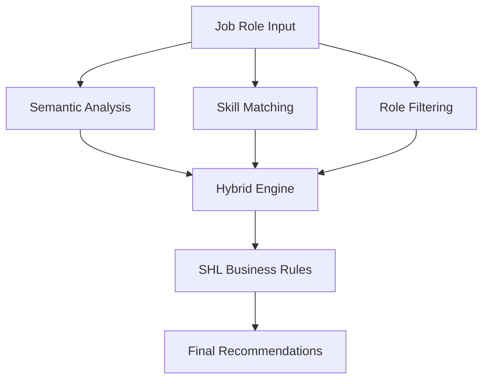
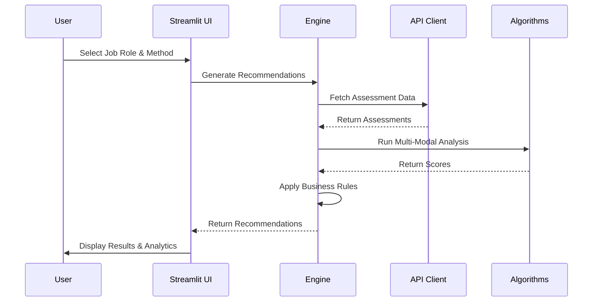

# SHL Assessment Recommendation Engine

<div align="center">

[](https://www.python.org/)
[](https://streamlit.io/)
[](https://www.sbert.net/)
[](https://shl.com/)

An intelligent AI-powered system that matches SHL assessments with job roles using advanced machine learning and professional API integration patterns.

Built for SHL AI Research Intern Application by **Aditya Kumar**

🚀 Live Demo • 📁 Project Structure • 🛠️ Installation • 🎯 Usage

</div>


🌟 Features

🧩**Multi-Modal Recommendation Engine**

- **Semantic Similarity:** NLP-based content matching using Sentence-BERT
- **Skill-Based Matching:** Jaccard similarity on skills overlap
- **Role-Specific Filtering:** Rule-based matching using domain expertise
- **Hybrid Approach:** Weighted combination of all methods for optimal results


🔌 **Enterprise API Integration**
- Professional SHL API Client with authentication simulation
- Rate Limiting and error handling
- Fallback Strategies for reliability
- Real-time API Status monitoring

🏗️ **Production-Ready Architecture**

- Type Hints throughout codebase
- Comprehensive Error Handling
- Logging and monitoring
- Data Validation and sanitization

📊 Demo

https://via.placeholder.com/800x400.png?text=SHL+Recommendation+Engine+Demo

Interactive dashboard showing recommendations, analytics, and comparison tools

🚀 Live Demo

Experience the application instantly:

https://static.streamlit.io/badges/streamlit_badge_black_white.svg

📁 Project Structure

```
shl-recommendation-engine/
├── 🎯 app.py                          # Main Streamlit application
├── 🧠 recommendation_engine.py        # Advanced recommendation engine
├── 🔌 shl_api_client.py              # Professional SHL API client
├── 🛡️ utils.py                       # Validation & error handling
├── 📊 assessment_catalogue.csv       # 100+ SHL-style assessments
├── 👔 job_descriptions.csv           # 20+ job roles with requirements
├── 📋 requirements.txt               # Python dependencies
└── 📖 README.md                      # This file
```

🛠️ Installation

Prerequisites

· Python 3.9 or higher
· pip (Python package manager)

Step-by-Step Setup

1. Clone the repository
   ```bash
   git clone https://github.com/your-username/shl-recommendation-engine.git
   cd shl-recommendation-engine
   ```
2. Create virtual environment (recommended)
   ```bash
   python -m venv venv
   source venv/bin/activate  # On Windows: venv\Scripts\activate
   ```
3. Install dependencies
   ```bash
   pip install -r requirements.txt
   ```
4. Run the application
   ```bash
   streamlit run app.py
   ```
5. Open your browser to http://localhost:8501

🎯 Usage

1. Select Job Role

Choose from 20+ predefined job roles including:

· AI Research Intern
· Data Scientist
· Machine Learning Engineer
· Business Analyst

2. Choose Recommendation Method

· Hybrid (Recommended): Combines all algorithms
· Semantic Similarity: NLP-based content matching
· Skill-Based Matching: Skills overlap analysis
· Role-Specific Filtering: Domain-expert rules

3. Apply Filters

· Duration: 10-120 minutes
· Difficulty: Beginner to Advanced
· Domain: Technical, Cognitive, Behavioral, etc.
· Minimum Match Score: 0.0-1.0

4. Analyze Results

· Interactive Visualizations: Score distributions and comparisons
· Detailed Explanations: AI-generated reasoning for each recommendation
· Export Options: Download results as CSV or JSON

🔧 API Integration

The system demonstrates professional API integration patterns:

```python
from shl_api_client import SHLAPIClient, load_assessments_with_fallback

# Professional API client with error handling
client = SHLAPIClient(api_key="your_api_key")

# Smart data loading with fallback
assessments = load_assessments_with_fallback(use_real_api=True)
```

API Features:

· ✅ Authentication handling
· ✅ Rate limiting simulation
· ✅ Error recovery and fallbacks
· ✅ Request retry logic
· ✅ Health check monitoring

🧠 Technical Architecture

Recommendation Algorithms



Data Flow

1. Input Processing: Job role analysis and feature extraction
2. Embedding Generation: Sentence-BERT for semantic understanding
3. Multi-Algorithm Processing: Parallel recommendation generation
4. Business Logic Application: SHL-specific rules and filters
5. Result Aggregation: Weighted scoring and ranking

System Workflow



Key Technologies

· Natural Language Processing: Sentence Transformers (all-MiniLM-L6-v2)
· Machine Learning: scikit-learn for similarity metrics
· Web Framework: Streamlit for interactive UI
· Data Visualization: Plotly for interactive charts
· API Integration: Requests with professional patterns

📊 Dataset Information

Assessments Catalog (100+ entries)

· Technical Assessments: Programming, Data Science, ML
· Cognitive Tests: Reasoning, Logic, Numerical
· Behavioral Assessments: Personality, Communication
· Domain-Specific: HR, Management, Analytics

Job Descriptions (20+ roles)

· AI/ML Roles: Research Intern, ML Engineer, Data Scientist
· Analytics Roles: Business Analyst, Data Analyst
· Technical Roles: Software Developer, Cloud Engineer
· Business Roles: Product Manager, HR Analyst

🚀 Deployment

Streamlit Cloud (Recommended)

1. Push code to GitHub
2. Connect repository at share.streamlit.io
3. Deploy automatically

Traditional Server

```bash
# Install dependencies
pip install -r requirements.txt

# Run with production settings
streamlit run app.py --server.port=8501 --server.address=0.0.0.0
```

🔮 Future Enhancements

· Docker Containerization for easy deployment
· Comprehensive Test Suite with pytest
· Real SHL API integration with official credentials
· User authentication and personalized recommendations
· A/B testing framework for algorithm evaluation
· Advanced analytics dashboard for HR insights
· Mobile-responsive design
· Multi-language support

👨‍💻 Author

Aditya Kumar
AI Research Intern Candidate
LinkedIn • GitHub

Built with passion for the SHL AI Research Intern position

📄 License

This project is created for demonstration purposes as part of the SHL AI Research Intern application process.

🙏 Acknowledgments

· SHL for the opportunity and inspiration
· Sentence-BERT team for the excellent embedding models
· Streamlit team for the amazing web framework
· Open-source community for invaluable tools and libraries

---

<div align="center">

If you like this project, please give it a ⭐ on GitHub!

"Transforming assessment matching with AI and professional engineering"

</div>

---

🎯 Quick Start Guide

For Evaluators:

1. Clone the repository
2. Run pip install -r requirements.txt
3. Execute streamlit run app.py
4. Open http://localhost:8501
5. Select a job role and click "Generate Recommendations"

Key Features to Test:

· 🔄 Toggle API Simulation in sidebar
· 📊 Try different recommendation methods
· 🎛️ Use filters to refine results
· 📈 Explore analytics tabs
· 💾 Export recommendations

The system is designed to demonstrate professional AI/ML engineering skills with enterprise-ready patterns.
